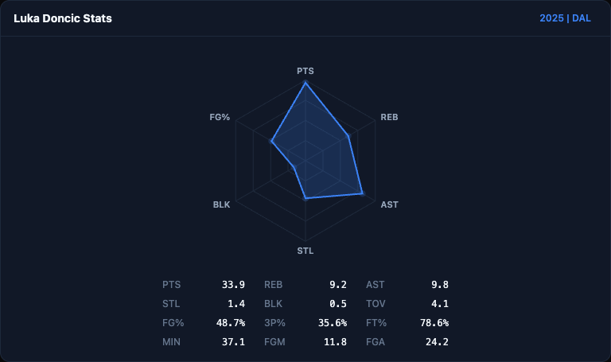
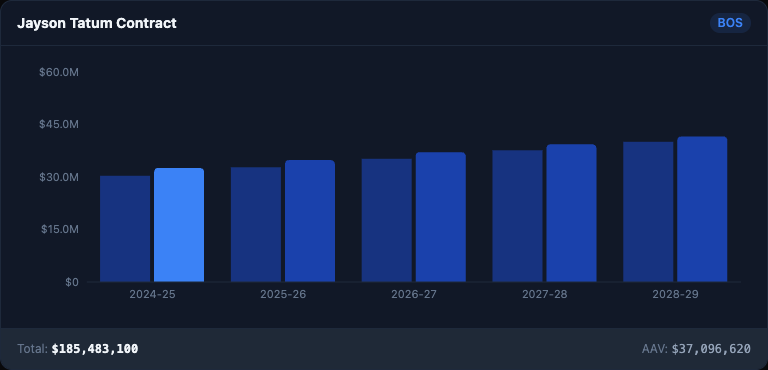
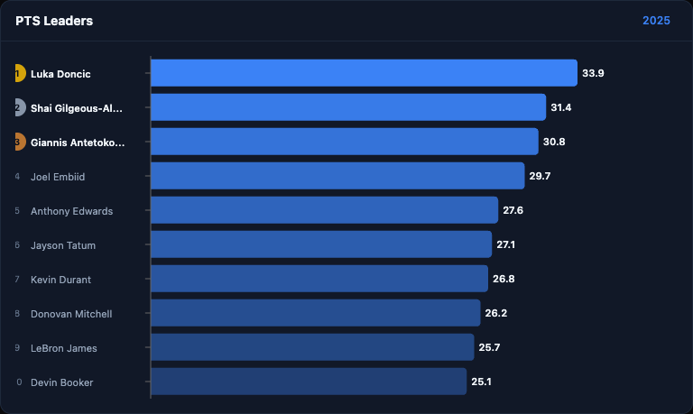
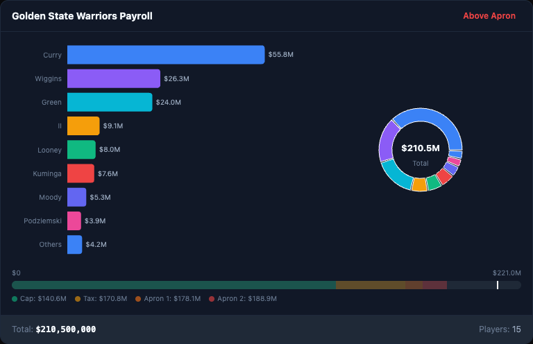
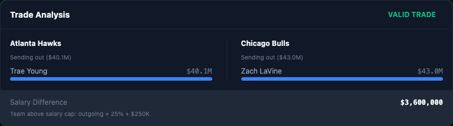
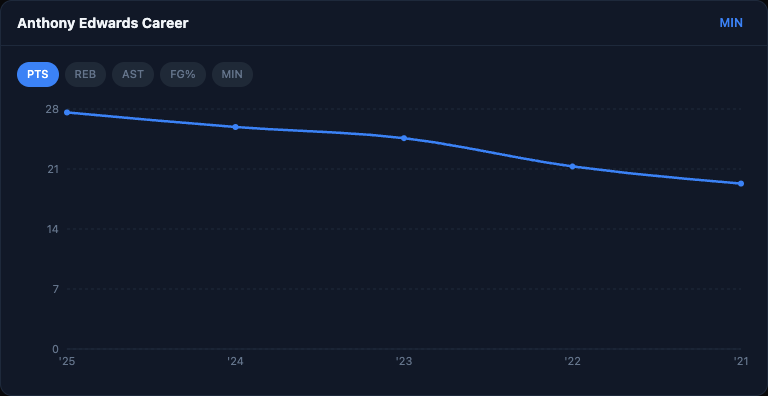

# QuickTip — NBA GM Copilot

An AI-powered NBA front office assistant. Ask about player contracts, salary cap analysis, trade scenarios, roster breakdowns, and stat leaders — backed by real NBA data.


## Features

- **Contract Lookup** — Player cap hits, base salaries, and multi-year breakdowns
- **Cap Sheet Analysis** — Full team salary breakdowns with luxury tax / apron proximity
- **Trade Analyzer** — Propose trades and get CBA salary-matching validation
- **Stat Leaders** — League leaders across 19 stat categories
- **CBA Rules Engine** — Salary cap thresholds, available exceptions (MLE, BAE, room), and trade rules
- **Inline Visualizations** — 11 Recharts components: contract timelines, radar charts, career trajectories, trade analysis cards, and more
- **Streaming Responses** — Real-time SSE streaming with tool call transparency

See [Usage Examples](docs/usage-examples.md) for all visualizations.

### Screenshots

<table>
  <tr>
    <td><strong>Player Radar</strong><br></td>
    <td><strong>Contract Timeline</strong><br></td>
  </tr>
  <tr>
    <td><strong>Stat Leaders</strong><br></td>
    <td><strong>Team Payroll</strong><br></td>
  </tr>
  <tr>
    <td><strong>Trade Analysis</strong><br></td>
    <td><strong>Career Trajectory</strong><br></td>
  </tr>
</table>

## Architecture

```
React Frontend (Vite + Tailwind)
    │  POST /api/chat (SSE)
    ▼
FastAPI Backend
    │  Orchestrator → keyword routing
    ▼
Specialist Agents (5)
    │  Contract · Trade · Roster · CBA · Stat Analyst
    ▼
Tool Layer (12 tools)
    │  SQL queries (asyncpg) + CBA rules (pure Python)
    ▼
PostgreSQL (BDL sports database — read-only)
```

The orchestrator classifies user intent via regex patterns and delegates to the appropriate specialist agent. Each agent runs an LLM tool-calling loop (up to 5 rounds) with access to a curated subset of tools.

## Prerequisites

- **Python 3.12+**
- **Node.js 18+**
- **Ollama** (default) or an **Anthropic API key**
- Access to the BDL PostgreSQL database

## Setup

### 1. Environment

Create a `.env` file at the project root:

```env
BDL_POSTGRES=postgresql://...        # Required: database connection string
LLM_PROVIDER=ollama                  # ollama (default) or anthropic
OLLAMA_MODEL=qwen3:8b                # Ollama model (default: qwen3:30b-a3b)
ANTHROPIC_API_KEY=sk-...             # Required if LLM_PROVIDER=anthropic
ANTHROPIC_MODEL=claude-sonnet-4-20250514  # Claude model (optional)
```

### 2. Backend

```bash
cd backend
python -m venv venv
source venv/bin/activate
pip install -r requirements.txt
```

### 3. Frontend

```bash
cd frontend
npm install
```

## Running

Start all three services:

```bash
# Terminal 1 — LLM (if using Ollama)
ollama serve

# Terminal 2 — Backend
source backend/venv/bin/activate
uvicorn backend.main:app --reload --port 8000

# Terminal 3 — Frontend
cd frontend
npm run dev
```

Open **http://localhost:5173** — the frontend proxies `/api` requests to the backend.

## API Endpoints

| Method | Path | Description |
|--------|------|-------------|
| `POST` | `/api/chat` | SSE streaming chat (main AI endpoint) |
| `GET` | `/api/team/{abbr}/cap-sheet` | Direct cap sheet lookup |
| `GET` | `/api/player/{name}/profile` | Player profile + stats + contract |
| `GET` | `/api/team/{abbr}/roster` | Team roster |
| `GET` | `/health` | Health check |

## Project Structure

```
backend/
  main.py                 # FastAPI app, CORS, lifespan
  db/pool.py              # asyncpg connection pool
  agents/
    orchestrator.py       # Intent classification + routing
    base_agent.py         # Tool-calling loop (shared by all agents)
    specialists.py        # 5 specialist agent definitions
    llm_client.py         # Ollama / Anthropic abstraction
  tools/
    registry.py           # Tool name → function + JSON schema mapping
    contract_tools.py     # Player contracts, cap sheets, free agents
    stat_tools.py         # Season/career stats, league leaders
    roster_tools.py       # Team rosters, player profiles
    cba_tools.py          # Salary cap rules (pure Python)
    trade_tools.py        # Trade analysis (composes other tools)
  routers/
    chat.py               # POST /api/chat SSE endpoint
    data.py               # Direct REST data endpoints

frontend/
  src/
    App.jsx               # Main layout + welcome screen
    VisualizationTestPage.jsx  # Fixture test page (?test=viz)
    hooks/useChat.js      # SSE consumer + message state
    components/
      ChatMessage.jsx     # Message renderer with markdown
      ChatInput.jsx       # Input bar
      ToolCallCard.jsx    # Tool call transparency UI
      ToolResultVisualization.jsx  # Tool → chart component mapping
      Sidebar.jsx         # Navigation sidebar
      visualizations/     # 11 Recharts components + ChartCard wrapper

docs/
  usage-examples.md       # Screenshots of all visualizations
  screenshots/            # Generated PNG screenshots
```

## License

MIT
