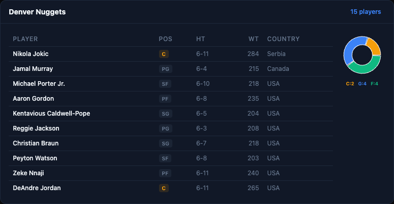
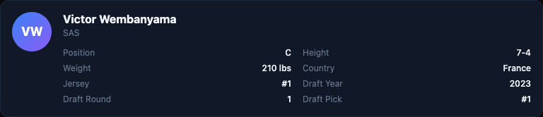
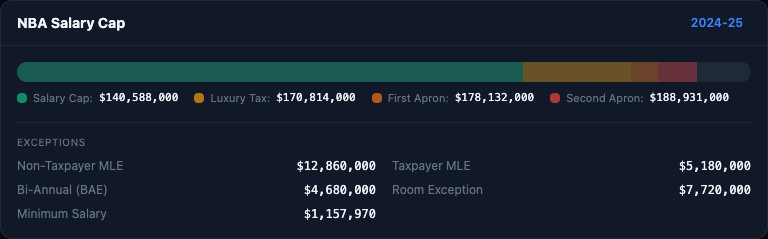
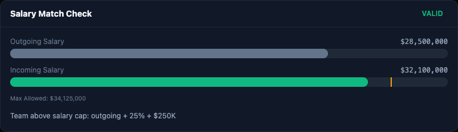
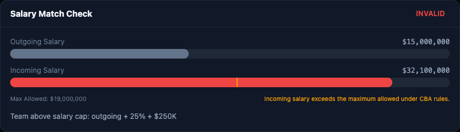
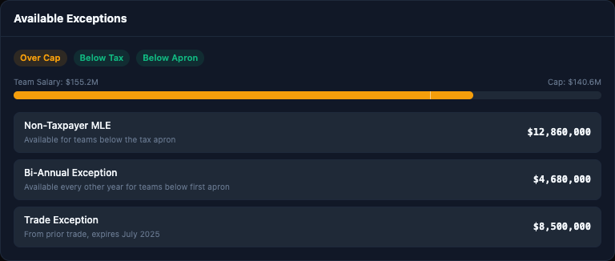

# QuickTip - Usage Examples

Visual examples of all 11 visualization components rendered with fixture data. These are the inline charts and cards that appear in chat responses when the AI agent calls backend tools.

To regenerate these screenshots, run the `/e2e-test` skill in Claude Code.

---

## Contract Timeline

Shows a player's multi-year contract with cap hit and base salary bars per season.

## Team Payroll

Horizontal bar chart of top player salaries plus a donut chart and cap gauge showing tax/apron proximity.

## Player Radar

Radar chart of 6 key stats (PTS, REB, AST, STL, BLK, FG%) with a full stat grid below.

## Career Trajectory

Line chart tracking a stat across seasons with selectable stat buttons (PTS/REB/AST/FG%/MIN).

## Stat Leaders

Horizontal bar chart ranking the top 10 league leaders in a stat category, with medal badges for top 3.

## Roster

Table with position badges, height, weight, and country columns plus a position distribution donut chart.

## Player Profile

Profile card with avatar initials, bio grid (position, height, weight, country, jersey, draft info).

## Cap Info

Threshold bar showing salary cap / luxury tax / first apron / second apron segments with exception values.

## Salary Match (Valid)

Progress bars comparing outgoing and incoming trade salaries with a threshold marker. Green = valid.

## Salary Match (Invalid)

Same layout but with red bars and a warning when incoming salary exceeds the CBA maximum.

## Available Exceptions

Status badges (cap/tax/apron), salary gauge, and exception cards showing available trade exceptions.

## Trade Analysis

Two-column layout showing each team's outgoing players with salary bars, validity badge, and salary difference.

